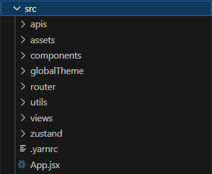

# React-Web-Tutorial

> web 樣式範例

## 使用方法

安裝 [npm](https://npmjs.org/) 套件

    $ yarn install

專案執行指令

    $ yarn start

## 環境版本

- node： 18.19.0
- react：18.1.0
- react-router-dom：6.23.0
- vite：5.2.11

## 後台功能

- 使用 material ui 框架，並配置好主題色
- 使用 zusatnd 做狀態管理

## 程式碼架構

|    區塊     |                   內容                       |          備註        |
| ----------  |  ------------------------------------------  | -------------------- |
| apis        | auth：會員登入登出 api                       | api                  |
| assets      | images：圖片檔案                             | 圖片、靜態檔         |
|             | locales：語系檔案                            |                      |
| components  | header：上方導覽功能（語系切換、會員資訊）    | 元件                 |
|             | navbar：左邊導覽功能                         |                      |
|             | notifier：消息條                             |                      |
| globalTheme | muiGlobalTheme：mui 主題色配置               | mui theme、全域 sass |
|             | variables.module.sass：顏色參數              |                      |
| router      | routes：頁面路徑設定                         | 路由設定             |
| utiles      | axios                                        | 工具                 |
|             | cookie                                       |                      |
| views       | login                                        | 頁面                 |
|             | errorPage：404 畫面                          |                      |
| zustand     | auth：會員資料儲存                           | 狀態管理             |
|             | loading：loading 顯示控制                    |                      |
|             | noticeStack：存放消息條                      |                      |